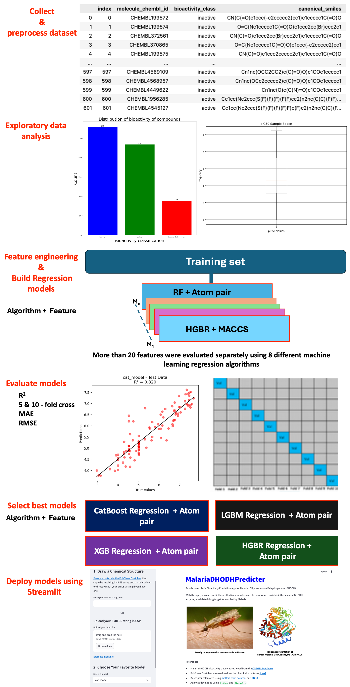

# Machine Learning-Driven QSAR Modeling for Malarial DHODH Inhibitors

## Project Description 
Malaria remains a global health concern, and the emergence of drug-resistant strains necessitates the development of new antimalarials. Human Malaria Parasite Plasmodium falciparum Dihydroorotate Dehydrogenase (PfDHODH), a key enzyme in the pyrimidine biosynthesis pathway, is a validated drug target for malaria.

This project addresses the need for novel antimalarial treatments by leveraging robust machine learning approaches for developing Quantitative Structure-Activity Relationship (QSAR) models. By integrating vast datasets of chemical compounds of validated drug target and their drug response profiles (IC50), this project fills critical gaps in traditional drug discovery pipelines, accelerating the identification and optimization of promising lead inhibitors for PfDHODH. The main goals include elucidating the structure-activity relationships of DHODH inhibitors and predicting the efficacy of compounds before they are synthesized and tested experimentally. Through this approach, the project aims to expedite the discovery of effective antimalarial drugs, ultimately contributing to the global effort to combat malaria.

## Workflow

The workflow involves several steps as explained in the workflow: collect data from the ChEMBL for the drug target, Dihydroorotate Dehydrogenase (CHEMBL3486), data cleaning and preprocessing, exploratory data analysis, more than 20 molecular features/description, and build regression ML QSAR models using hist gradient boosting regressor, support vector regressor, linear regressor, gradient boosting regressor, XGB regressor, LGBM regressor, Cat boost regressor, and Random forest regressor, and evaluate the models using metrics such as R2, RMSE and MAE, and 5 and 10 fold cross-validation. Here, I am sharing the code for building a machine-learning model with atom pair molecular descriptors as it shows reasonably promising results compared to the other molecular features. 

## Data
Human Malaria Parasite Plasmodium falciparum Dihydroorotate Dehydrogenase (PfDHODH) inhibition data was retrieved from the ChEMBL database (https://www.ebi.ac.uk/chembl/) using the target protein identifier, Plasmodium falciparum dihydroorotate dehydrogenase(CHEMBL3486). The dataset included 602 compounds with biological inhibition IC50 values against Plasmodium falciparum DHODH and their structures, etc. Missing activity values and ambiguous SMILES structures were removed. You can find the dataset in the  folder.

## Code Description
The codes are provided as a Jupyter Notebook in the "notebooks" folder. All the code was developed on an osx-64 workstation. The Jupyter Notebooks contain detailed explanations and comments to guide users through each step of the QSAR modeling process, from data collection to model selection.

1. Data collection 
2. Data preprocessing
3. Exploratory Data Analysis (EDA)
4. Feature engineering, model training, and evaluation and selection   
5. Model deployment using Streamlit web app

# Results

# GUI/How to use the appp 

# Installation
conda env create -f malaria_dhodh.yml or pip install -r requirements.txt or install the required packages manually using pip install package_name or conda install package_name.

pip install streamlit

## Run the Streamlit app
streamlit run app_streamlit.py

Malarial DHODH QSAR models in action! Experience the interactive Streamlit app here: [MalariaDHODHPredicter Streamlit App](https://share.streamlit.io/yourusername/yourrepo/app_streamlit.py)

## Future development
In the future, I plan to implement a user-friendly interface that will allow for the direct input of the 2D structure of compounds and incorporate ensemble methods to enhance the prediction accuracy and robustness of the models.
